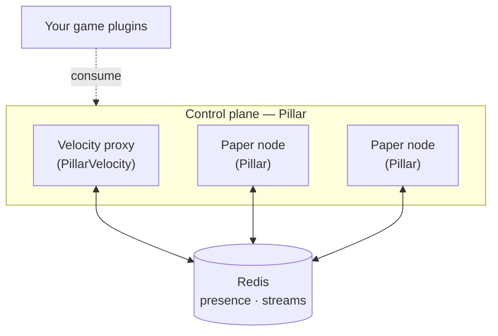

<p align="center">
  
</p>

<p align="center">
  
  
  
  <a href="https://discord.gg/5bw8RkSVwP"></a>
</p>

<br>

Pillar is the **control plane** for Minecraft networks. It handles fleet presence, inter-node messaging, and health-aware server placement so game plugins do not have to.

One artifact runs on both sides of the network: `paper.Pillar` on game servers and `velocity.PillarVelocity` on the proxy. Nodes discover and communicate with each other over Redis. There is no central coordinator to deploy or maintain.



## Documentation

The complete documentation for Pillar, including installation guides, API references, architecture overviews, and developer cookbooks, is available at **[pillar.markineo.com.br](https://pillar.markineo.com.br)**.

## Features

| Feature                | Description                                                                                |
|------------------------|--------------------------------------------------------------------------------------------|
| **Fleet presence**     | Nodes advertise with an expiring heartbeat; dead nodes disappear without cleanup.          |
| **Stream transport**   | Durable, at-least-once messaging over Redis Streams with consumer groups.                  |
| **Request/response**   | Correlated messaging with a `CompletableFuture` reply and configurable timeout.            |
| **Health snapshots**   | Nodes publish MSPT, memory, and player count for fleet-wide visibility.                    |
| **Placement engine**   | Power-of-two-choices selection with hard caps and in-flight reservations.                  |
| **Resilient dispatch** | Bounded worker pool, acknowledge-after-success, deduplication, and stranded-work recovery. |
| **Admin commands**     | Inspect fleet state, connection health, and node latency at runtime.                       |

## Getting started

**Prerequisites:** Redis, a Velocity proxy, and one or more Paper servers on Java 25.

1. Download `Pillar-<version>.jar` from [Releases](#).
2. Place it in `plugins/` on the Velocity proxy and each Paper server.
3. Configure each node to point at your Redis instance.
4. Start the network and run `/pillar fleet` to verify all nodes are visible.

### Configuration

Configuration is YAML, written to the plugin's data folder on first run.

| File | Scope |
|---|---|
| `config.yml` | Paper: server name, role, Redis connection, language. |
| `config-velocity.yml` | Velocity: proxy name, Redis connection, language. |
| `lang/en-us.yml`, `lang/pt-br.yml` | MiniMessage-formatted message catalogs. `en-us` is the fallback. |

Critical fields (identity, Redis host) are validated at startup. A missing value aborts with a clear message.

### Commands

All subcommands require `pillar.admin`. The same surface is available on Paper and Velocity.

| Command | Description |
|---|---|
| `/pillar fleet` | Lists every node in the fleet. |
| `/pillar status` | Connection state, pending inbox entries, and a log tail. |
| `/pillar ping <server>` | Round-trip latency to another node. |
| `/pillar reload` | Reloads message catalogs and by-path config values. |

## Building

Gradle + Shadow, Java 25 toolchain. Jedis and SnakeYAML are shaded and relocated under `br.com.markineo.pillar.lib`.

```bash
./gradlew shadowJar   # produces the shaded plugin jar in build/libs/
./gradlew compileJava # compilation check only
```

## Testing

Unit tests (JUnit 5) cover the core logic: envelope codec, correlation, dispatch, placement, and a synthetic load harness. Integration tests use Testcontainers and self-skip when Docker is unavailable.

```bash
./gradlew test
```

A local topology (proxy, two Paper nodes, Redis) is available in `test-topology/` for end-to-end verification.

## Roadmap

- [x] Fleet presence, stream transport, correlated request/response, diagnostics.
- [x] Health snapshots, placement engine, resilient dispatch.
- [ ] Player routing and lease primitive (MVP completion).
- [ ] Hardening: dead-consumer recovery, degraded-mode behavior, telemetry, stable public API.

## Contributing

See the [contribution guide](https://pillar.markineo.com.br/contributing/guidelines) for coding standards, environment setup, and the PR flow.

## License

[Apache 2.0](LICENSE.md)
