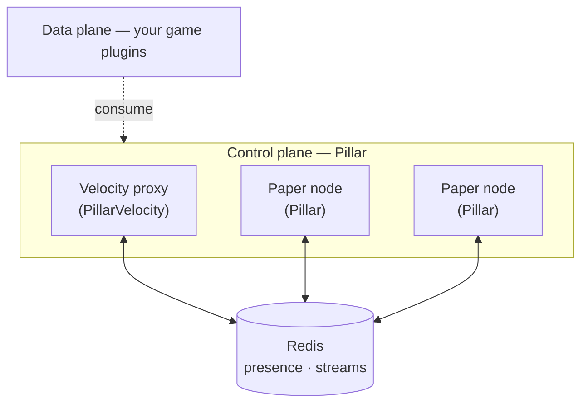

# Pillar

**The control plane for Minecraft networks.** Presence, messaging, and health-aware
placement for a fleet of servers — as one plugin that runs on both your game servers and
your proxy.

<!-- TODO: wire real badges once CI/releases exist. -->


> Pillar gives a multi-server network a shared nervous system: every node knows who else
> is alive, can send a message and get an answer, and can decide where new work should
> land — without a central registry to babysit or a database to poll.

---

## The problem

Running a Minecraft network means running *many* servers that have to act like one. The
moment you have a proxy in front of two or more backends, you inherit a set of problems
that have nothing to do with your game:

- Servers need to **discover each other** and notice when one dies.
- They need to **talk** — request something from another node and get a reply.
- New players and tasks need to **land somewhere sensible**, not all pile onto the same
  box during a login rush.
- And all of this has to **survive a server crashing** at the worst possible moment.

The usual answers strain under load. Proxy plugin-messaging only works while a player is
connected to relay through. A shared database polled in a loop becomes a bottleneck and a
single point of failure. Naive pub/sub drops messages when a consumer is down, and "just
send it to the emptiest server" stampedes everyone onto the same node before any counter
catches up.

Pillar exists to solve this layer once, correctly, so game plugins don't have to.

## What Pillar is

Pillar is the **control plane**. It owns the cross-cutting infrastructure: fleet
awareness, transport, and placement decisions. Your game plugins — skyblock, minigames,
whatever you build — are the **data plane**: they own their worlds, schemas, and
mechanics, and they consume Pillar.

One artifact runs on both sides of the network:

- On **Paper** game servers, the entry point is `paper.Pillar`.
- On **Velocity** proxies, the entry point is `velocity.PillarVelocity`.

They discover and talk to each other over **Redis**. There is no central coordinator
process to deploy or keep alive — the fleet is self-describing.

<!-- TODO: replace with a rendered control-plane / data-plane diagram image. -->



## Key ideas

A few principles shape every decision in Pillar:

- **Design for failure first.** Assume messages get redelivered, nodes crash mid-task,
  and pools saturate. Every mechanism has a defined behavior for the bad day, not just
  the happy path.
- **Mechanism, not policy.** Pillar gives you typed primitives and lets the consumer
  decide domain policy (whether to retry, queue, or tell the player).
- **No central registry.** Liveness is expressed with expiring keys, so a dead node
  removes itself. There is nothing to clean up.
- **One artifact, two adapters.** The core logic is platform-agnostic; Paper and Velocity
  are thin edges around it.

## Features

- **Fleet presence** — every node advertises itself with an expiring heartbeat; dead
  nodes disappear automatically.
- **Stream transport** — durable, at-least-once messaging between nodes over Redis
  Streams with consumer groups.
- **Correlated request/response** — send a message, get a `CompletableFuture` for the
  reply, with a built-in timeout.
- **Health snapshots** — nodes publish MSPT, memory, player count, and load signals the
  fleet can read.
- **Placement engine** — health-aware server selection (power-of-two-choices with hard
  caps and in-flight reservations) to spread load without stampedes.
- **Resilient dispatch** — a bounded worker pool, acknowledge-after-success, duplicate
  detection, and recovery of stranded work.
- **Admin commands** — inspect the fleet, connection health, and latency at a glance.

<!-- TODO: keep this list honest against the current iteration as features land. -->

## How it works

Each piece of Pillar answers a concrete failure of the naive approach:

| The problem | How Pillar solves it | Why it holds up |
|---|---|---|
| Nodes must find each other without a registry to maintain | Expiring heartbeat keys in Redis (`SETEX`, native TTL) | A dead node's key expires on its own within seconds — no cleanup job, no stale entries |
| A message must survive a node crashing mid-work | Redis Streams + consumer groups, acknowledged **after** the handler succeeds | Unacknowledged work is redelivered, never silently lost |
| Redelivery must not double-execute a side effect | Message-id deduplication with a bounded TTL window | Retries are safe by construction, so at-least-once is usable in practice |
| A login storm piling everyone onto one server | Power-of-two-choices over live health plus in-flight reservations | No single "least-loaded" reading can stampede one node |
| Slow work blocking the message loop | A bounded worker pool with natural backpressure | Saturation is a handled, expected state — not a freeze |

The technologies are deliberately boring and battle-tested: **Redis** for presence and
transport, **Redis Streams** (not pub/sub) for durability, and plain **Java** for the
decision logic so it stays testable in isolation.

## Architecture

Pillar is organized so the decision logic never depends on the platform or the driver:

```
br.com.markineo.pillar
├── core        Pure Java: identity, fleet, task envelope, placement logic (no Jedis, no platform)
├── error       Unchecked exception hierarchy (PillarException)
├── logger      Logging over SLF4J with a diagnostics ring buffer
├── concurrent  Named executors and the platform-scheduler seam
├── config      YAML loading, typed settings, language catalogs
├── redis       The only package that imports Jedis: connection, presence, transport
├── paper       Paper adapter — entry point, commands, main-thread scheduler
└── velocity    Velocity adapter — entry point, command, scheduler
```

The rule is simple: **`core` stays pure, only `redis` touches Jedis, and the platform
adapters stay thin.** That boundary is what keeps the placement and transport logic
unit-testable without a running server.

<!-- TODO: link a public ARCHITECTURE.md (message-flow diagram + boundary rules) here. -->

## Getting started

**Prerequisites:** a reachable Redis instance, a Velocity proxy, and one or more Paper
servers running on a Java 25 runtime.

1. Download the latest `Pillar-<version>.jar` from Releases. <!-- TODO: releases -->
2. Drop it into the `plugins/` folder of your Velocity proxy **and** each Paper server.
3. Point each node at your Redis instance in its config (see below).
4. Start the proxy and the backends. Run `/pillar fleet` to confirm every node sees the
   others.

## Configuration

Configuration is plain YAML, extracted to the plugin's data folder on first run.

- **Paper** — `config.yml`: server `name`/`role`, `redis` connection and pool, active
  `language`.
- **Velocity** — `config-velocity.yml`: proxy `name`, `redis` connection and pool,
  `language`.
- **Languages** — `lang/en-us.yml`, `lang/pt-br.yml`: MiniMessage-formatted message
  catalogs (`en-us` is the fallback).

Critical values (identity, Redis host) are read **fail-fast**: a missing or empty one
aborts startup with an actionable message instead of failing mysteriously later.

## Commands

`/pillar` (permission `pillar.admin`) — the same surface on Paper and Velocity:

| Subcommand | Description |
|---|---|
| `/pillar fleet` | Lists every node currently in the fleet. |
| `/pillar status` | Connection state, pending inbox entries, and a recent-activity log tail. |
| `/pillar ping <server>` | Measures round-trip latency to another node. |
| `/pillar reload` | Reloads message text and by-path config values. |

## Building from source

Gradle + Shadow on a Java 25 toolchain. Jedis and SnakeYAML are bundled and relocated
under `br.com.markineo.pillar.lib` so they can't clash with other plugins.

```bash
# Package the shaded plugin jar
./gradlew -p Pillar shadowJar          # *nix
Pillar/gradlew.bat -p Pillar shadowJar # Windows

# Compile only (the fast inner-loop check)
./gradlew -p Pillar compileJava
```

The shaded jar lands at `Pillar/build/libs/`.

## Testing

Pure-unit tests (JUnit 5) cover the logic — envelope codec, correlation, dispatch,
placement, and a simulation harness that drives synthetic load through the placement
engine. Redis-backed behavior is covered by integration tests (Testcontainers) that
self-skip when Docker is absent.

```bash
./gradlew -p Pillar test
```

A ready-made local network (a proxy, two Paper nodes, and Redis) lives in
`test-topology/` for end-to-end checks.

## Roadmap

- **Done — inter-node communication.** Presence, stream transport, correlated
  request/response, diagnostics.
- **Done — the decision engine.** Health snapshots, placement logic, and resilient
  dispatch (worker pool, at-least-once, deduplication, stranded-work recovery).
- **Next — player routing and leases.** Move players between servers through the proxy
  and expose a generic lease primitive for ownership. This completes the MVP.
- **Later — hardening and a public API.** Recovery from dead consumers, defined degraded
  modes, decision telemetry, and a stable, versioned API surface.

## Contributing

Pillar follows a strict, deliberately small style: American English everywhere, comments
that explain *why* rather than *what*, constructor injection, immutability by default, no
mutable static state, and the smallest solution that works.

<!-- TODO: link a public CONTRIBUTING.md distilled from the internal standards. -->

## License

Apache-2.0. <!-- TODO: add LICENSE file and per-source headers. -->

<!-- TODO: optional footer — AI-assistance disclosure, open-source strategy note. -->
